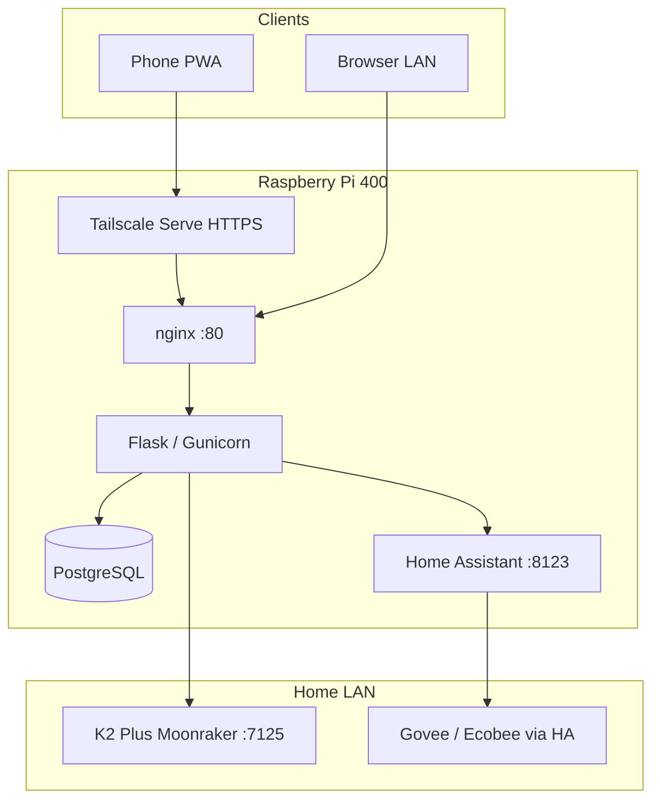

# Home OS Hub

Self-hosted homelab dashboard on **Raspberry Pi** — multi-container Docker stack, secure remote access, and LAN integrations for fitness tracking, smart home, and 3D printer monitoring.

Built as a **homelab / infrastructure portfolio project** (Docker, networking, Linux ops, IoT glue) — not a commercial app.

## What it does

- **Two-user web dashboard** — workouts, body weight, stats, PWA install on phones
- **Smart home panel** — Home Assistant REST (lights, sensors)
- **3D printer panel** — Creality K2 Plus via Moonraker (status, preheat, history, pause/resume/cancel)
- **Production stack** — nginx → Gunicorn/Flask → PostgreSQL
- **Remote access** — Tailscale Serve (HTTPS on tailnet for mobile PWA)

## Architecture



```
Phone (Tailscale HTTPS) ──► nginx:80 ──► Flask:8000 ──► PostgreSQL
                                │              │
                                │              ├──► Home Assistant :8123
                                │              └──► Printer Moonraker :7125 (LAN)
```

## Tech stack

| Layer | Technology |
|-------|------------|
| App | Flask, Flask-Login, SQLAlchemy, Jinja |
| Database | PostgreSQL 16 (prod), SQLite (local dev) |
| Reverse proxy | nginx |
| Containers | Docker Compose (web, db, nginx, optional HA) |
| Remote access | Tailscale Serve (HTTPS) |
| Integrations | Home Assistant REST, Moonraker/Klipper |
| Frontend | Tailwind CSS, vanilla JS, Chart.js, PWA |

## Quick start — local dev

No Postgres required — SQLite at `instance/dev.db`.

```bash
git clone https://github.com/RamtikiNowiki/HomeOS.git
cd HomeOS
python3 -m venv .venv && source .venv/bin/activate
pip install -r requirements.txt
cp .env.example .env
python seed.py
python wsgi.py    # http://127.0.0.1:5000
```

Default dev logins (override in `.env` before `seed.py`):

| Profile | Username | Password |
|---------|----------|----------|
| User 1 | `ram` | `changeme1` |
| User 2 | `aylin` | `changeme2` |

## Production — Raspberry Pi

```bash
git clone https://github.com/RamtikiNowiki/HomeOS.git && cd HomeOS
cp .env.example .env
nano .env    # SECRET_KEY, POSTGRES_PASSWORD, profile passcodes
docker compose up -d --build
```

Or use the bootstrap script: **`bash scripts/pi-bootstrap.sh`**

Open `http://<pi-lan-ip>/` — see **[DEPLOY.md](DEPLOY.md)** for Pi setup, PWA, and Tailscale HTTPS.

## Integrations

| Integration | Config | Docs |
|-------------|--------|------|
| Home Assistant | `.env` → `HOME_ASSISTANT_*` | [INTEGRATIONS.md](INTEGRATIONS.md) |
| Creality K2 / Moonraker | `.env` → `CREALITY_K2_HOST` | [INTEGRATIONS.md](INTEGRATIONS.md) |
| Optional HA container | `docker-compose.ha.yml` | [INTEGRATIONS.md](INTEGRATIONS.md) |

Helper script: `scripts/configure-ha-env.sh` wires HA token into `.env` and restarts the app.

## Security

- **No secrets in git** — `.env` is gitignored; use `.env.example` as template
- **HTTPS remote** — Tailscale Serve + `COOKIE_SECURE=1` for production PWA
- **HA auth** — long-lived access tokens only (never commit tokens)

See **[SECURITY.md](SECURITY.md)** before deploying or contributing.

## Project docs

| File | Purpose |
|------|---------|
| [DEPLOY.md](DEPLOY.md) | Pi deployment, PWA, Tailscale |
| [INTEGRATIONS.md](INTEGRATIONS.md) | HA, K2, camera, architecture roadmap |
| [PROJECT.md](PROJECT.md) | Full feature and route reference |

## Roadmap

- [ ] Govee / Ecobee via Home Assistant
- [ ] K2 camera (Creality Helper Script on printer)
- [ ] Print-complete notifications (HA automation)
- [ ] Pi 5 node: Hermes Agent + Ollama (planned)

## Author

Homelab infrastructure portfolio — Docker, Linux, networking, IoT integration.

Relevant certs: **AZ-104**, **CCNA**, **Security+**, **RHCSA** (in progress).

## License

Private homelab project — add a license file if you fork for public use.
