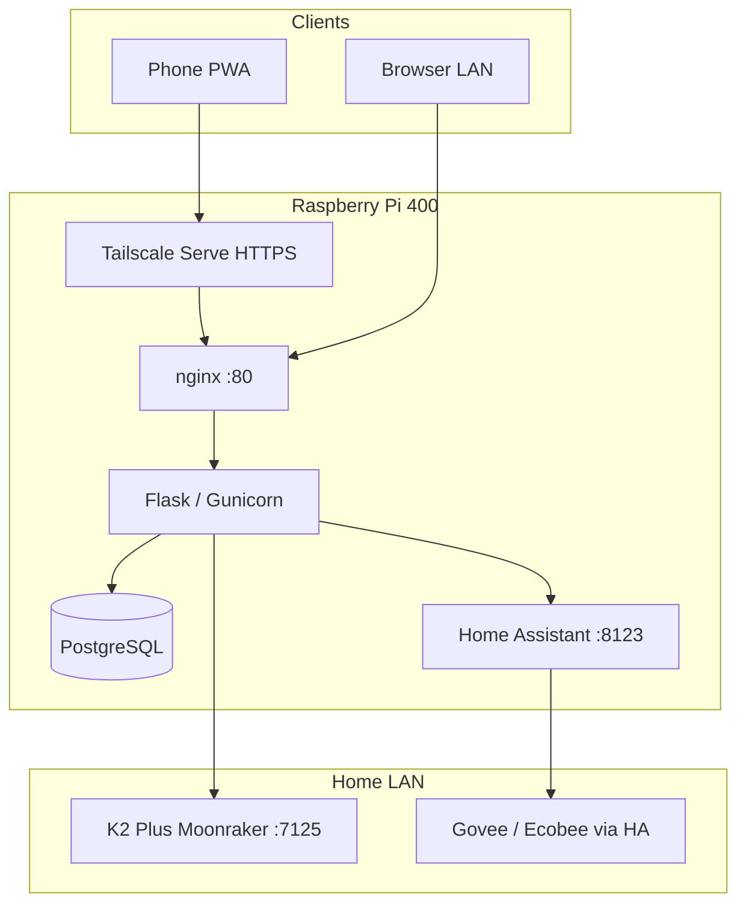

# Home OS Hub

**Self-hosted homelab command center** — fitness tracking, smart home, and 3D printer monitoring on a Raspberry Pi, with Docker, Tailscale HTTPS, and Home Assistant integration.

> Homelab / infrastructure portfolio project — Docker, Linux networking, IoT integration, and secure remote access. Built for real daily use by two household users.

[](docker-compose.yml)
[](requirements.txt)
[](app/)
[](DEPLOY.md)

## Why this project

I wanted a single private dashboard for gym logging, home devices, and printer status — reachable from phones at home or away — without relying on cloud SaaS. The stack runs entirely on a **Pi 400** with **Docker Compose**, **Tailscale** for HTTPS remote access, and **LAN API integrations** to Home Assistant and Moonraker.

This repo documents the full deployment: nginx reverse proxy, PostgreSQL persistence, PWA install, and ops scripts for bootstrap and integration wiring.

## What's live today

| Area | Features |
|------|----------|
| **Fitness** | Workout sessions, exercise library, PR tracking, charts, body weight, PWA |
| **Smart home** | Home Assistant REST — light toggles, sensor readout on dashboard |
| **3D printer** | K2 Plus via Moonraker — live status, preheat presets, print history, pause/resume/cancel |
| **Infrastructure** | Docker (web + Postgres + nginx), optional HA container, Tailscale Serve HTTPS |
| **Ops** | `pi-bootstrap.sh`, `configure-ha-env.sh`, health checks, idempotent seed/migrations |

## Architecture (current)



## Planned architecture (roadmap)

A **Raspberry Pi 5 (8 GB)** will run **Hermes Agent + Ollama** as a dedicated AI node. Home OS and Home Assistant stay on the Pi 400; Hermes talks to HA over the LAN. A future **“Ask Home”** panel in the Flask app will send natural-language requests to Hermes (e.g. *“turn off all the lights”*, *“what’s the thermostat set to?”*).

```
Pi 400 (today)                    Pi 5 (planned)
├── Home OS (Flask)               ├── Ollama (local LLM)
├── Home Assistant                └── Hermes Agent
└── nginx / Postgres                      │
         │                                │
         └──────── HA REST ◄──────────────┘
                    │
              Govee · Ecobee · automations
```

## Tech stack

| Layer | Technology |
|-------|------------|
| App | Flask, Flask-Login, SQLAlchemy, Jinja |
| Database | PostgreSQL 16 (prod), SQLite (local dev) |
| Reverse proxy | nginx |
| Containers | Docker Compose (web, db, nginx, optional HA) |
| Remote access | Tailscale Serve (HTTPS) |
| Integrations | Home Assistant REST, Moonraker/Klipper |
| Frontend | Tailwind CSS, vanilla JS, Chart.js, PWA |

## Quick start — local dev

```bash
git clone https://github.com/RamtikiNowiki/HomeOS.git
cd HomeOS
python3 -m venv .venv && source .venv/bin/activate
pip install -r requirements.txt
cp .env.example .env
python seed.py
python wsgi.py    # http://127.0.0.1:5000
```

Default dev logins (override in `.env` before `seed.py`):

| Profile | Username | Password |
|---------|----------|----------|
| User 1 | `ram` | `changeme1` |
| User 2 | `aylin` | `changeme2` |

## Production — Raspberry Pi

```bash
git clone https://github.com/RamtikiNowiki/HomeOS.git && cd HomeOS
cp .env.example .env
nano .env    # SECRET_KEY, POSTGRES_PASSWORD, profile passcodes
docker compose up -d --build
```

Or: **`bash scripts/pi-bootstrap.sh`** — see **[DEPLOY.md](DEPLOY.md)** for PWA, Tailscale HTTPS, and HA container setup.

## Integrations

| Integration | Config | Docs |
|-------------|--------|------|
| Home Assistant | `.env` → `HOME_ASSISTANT_*` | [INTEGRATIONS.md](INTEGRATIONS.md) |
| Creality K2 / Moonraker | `.env` → `CREALITY_K2_HOST` | [INTEGRATIONS.md](INTEGRATIONS.md) |
| Optional HA container | `docker-compose.ha.yml` | [INTEGRATIONS.md](INTEGRATIONS.md) |

## Security

- No secrets in git — `.env` is gitignored ([SECURITY.md](SECURITY.md))
- HTTPS remote via Tailscale + `COOKIE_SECURE=1`
- HA long-lived tokens only (never committed)

## Roadmap

**Near term**
- [ ] Govee lights + Ecobee thermostat via Home Assistant
- [ ] K2 live camera (Creality Helper Script on printer)
- [ ] Print-complete push notifications (HA → phone)

**Future — AI home assistant (Pi 5 + Hermes + Ollama)**
- [ ] Dedicated Pi 5 node running Ollama (local LLM) and Hermes Agent
- [ ] Hermes ↔ Home Assistant over LAN (device control, automations)
- [ ] **“Ask Home” in Home OS** — natural-language panel in the Flask app backed by Hermes
- [ ] Telegram / voice as additional Hermes channels (gym, away from home)

## Screenshots

_Add dashboard, printer panel, and Home Assistant connected views to `docs/screenshots/` — redact IPs and passcodes._

## Documentation

| File | Purpose |
|------|---------|
| [DEPLOY.md](DEPLOY.md) | Pi deployment, PWA, Tailscale |
| [INTEGRATIONS.md](INTEGRATIONS.md) | HA, K2, camera, multi-Pi architecture |
| [PROJECT.md](PROJECT.md) | Feature and route reference |
| [SECURITY.md](SECURITY.md) | Secrets and pre-push checklist |

## Author

**Ram** — homelab / infrastructure portfolio project.

Certifications: **AZ-104** · **CCNA** · **Security+** · **RHCSA** (in progress)

Focus: network administration, systems administration, cloud & IT infrastructure — this project demonstrates Docker orchestration, Linux ops, secure remote access, and IoT integration in a production homelab.

## License

[MIT](LICENSE) — homelab portfolio project; use and adapt with attribution.
